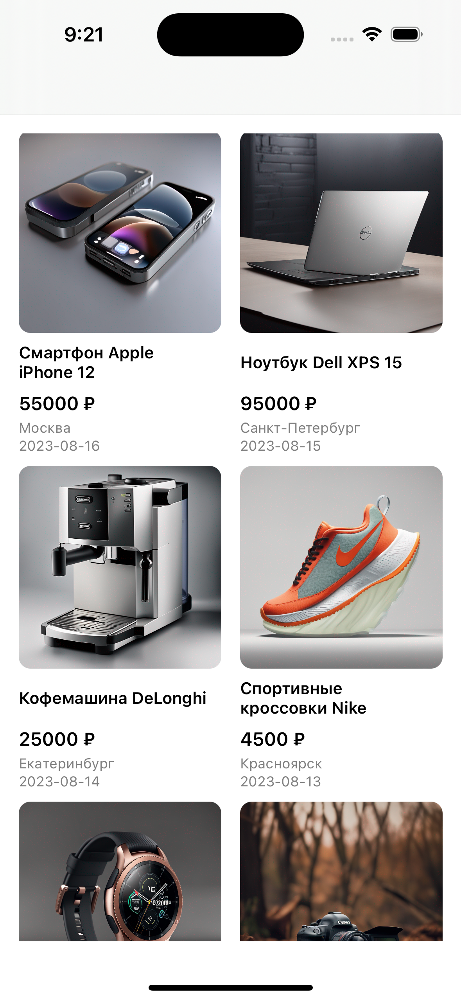
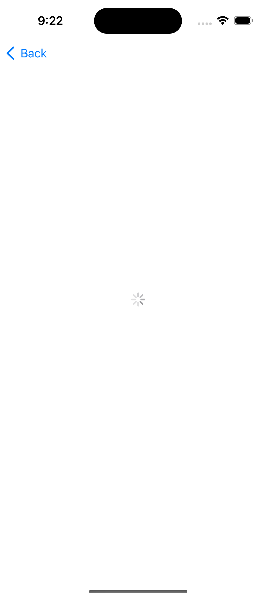

# Avito-test-task-2023

Тестовое здание на позициию стажера IOS разработчика в компанию Avito.

### Общее описание задания:
Написать приложение для iOS, которое будет состоять из двух экранов: 
- Список товаров, данный экран будет стартовым.
- Детальная карточка товара, будет открываться по нажатию на элемент в списке товаров.

### Требование к реализации:
У каждого экрана должно быть три состояния: 
- Отображение ошибки
- Состояние загрузки
- Отображение контента из JSON файла

Внешний вид приложения реализовывается на усмотрение кандидата, за референс можно брать приложение Авито.
Для каждого экрана нужно будет загружать данные в формате JSON из интернета: 
- https://www.avito.st/s/interns-ios/main-page.json
    - URL для запроса на главном экране.
- https://www.avito.st/s/interns-ios/details/{itemId}.json
    - URL для запроса на детальной странице. ID берется из данных для главного экрана. 
    - Пример ссылки: https://www.avito.st/s/interns-ios/details/1.json

### Требования к коду:
1. Приложение написано на языке Swift. 
2. Пользовательский интерфейс приложения реализован кодом без использования SwiftUI.
3. Для отображения списка используется UICollectionView с отображением в 2 столбца.
4. Для запроса данных используется URLSession.

### Инструкция по запуску приложения

1. Склонируйте или скачайте актуальную версию данного репозитория изи ветки main.

```git clone https://github.com/mzoraida/avito-test-task-2023.git```

2. После клонирования репозитория перейдите в директорию проекта через терминал с помощью команды, представленной ниже или через finder.

```cd avito-test-task-2023/avito-test-task```

3. После этого открой `avito-test-task.xcodeproj` можете открыть через finder, либо ввести в терминале команду:

```open avito-test-task.xcodeproj```

4. Соберите и запустите проект на симуляторе iOS или реальном устройстве.

## Визуальная состовляющая проекта

1. Экран со списком товаров 



2. Экран с детальной информацией о товаре 


3. Экран загрузки 



4. Экран ошибки 


